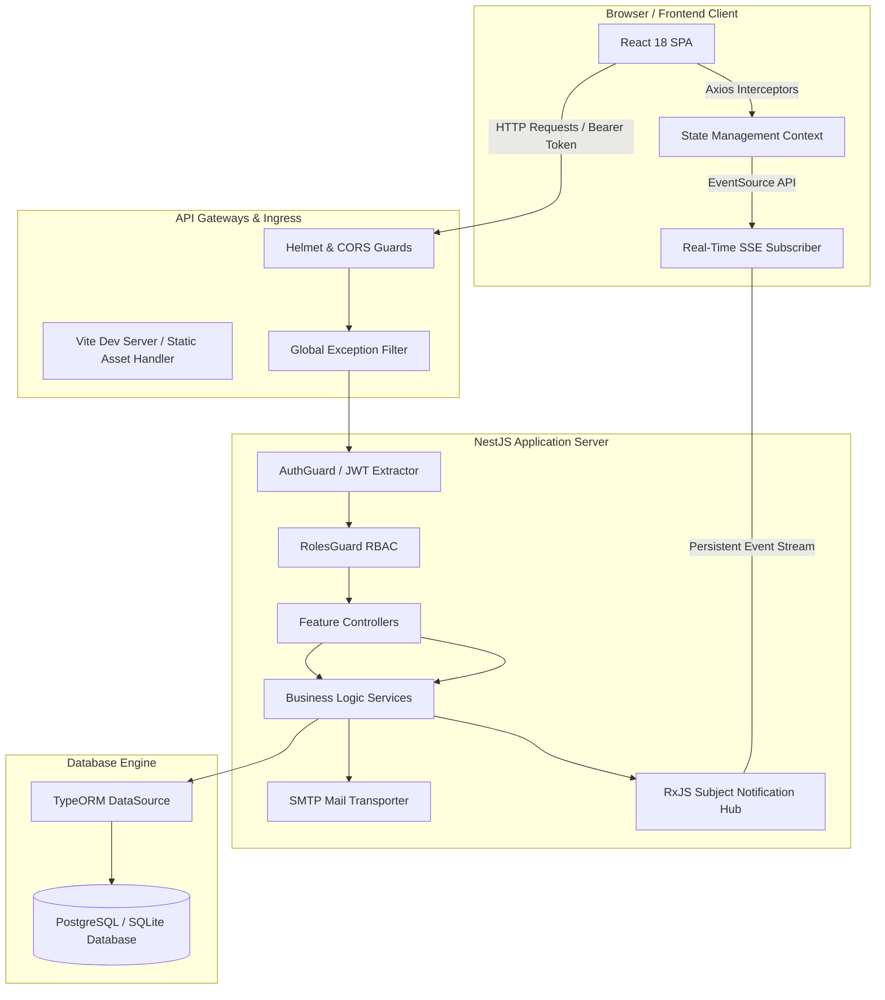

# TaskFlow Pro - Ultimate Full-Stack Project Management Platform

TaskFlow Pro is a highly polished, enterprise-grade, full-stack project management application. Engineered for agile squads, it features a fluid React SPA, a robust NestJS backend, and a TypeORM relational database layer. The platform supports seamless team coordination, dynamic Kanban workspaces, automated email cycles, auditing trails, and instant real-time Server-Sent Event (SSE) notifications.

---

## Architectural Topology & Communication Flow

TaskFlow Pro employs a decoupled **Client-Server-Relational Architecture** designed to maximize operational security, minimize state synchronization latency, and support containerized deployments.



### Complete Request/Response Lifecycle

1. **Client Initiation**: The user performs an action (e.g., updates task status). The React SPA sends an asynchronous HTTP request using the custom Axios instance.
2. **Access Token Header**: If authenticated, the client automatically appends the Bearer access token to the `Authorization` header.
3. **Security Ingress**: The underlying Express engine processes CORS permissions and applies security headers via Helmet middleware.
4. **JWT Extraction & Account Validation**: The global `AuthGuard` extracts the token, verifies its signature against `JWT_SECRET`, queries the database to confirm user existence, and verifies the account is active.
5. **Role-Based Authorization (RBAC)**: The `RolesGuard` compares the route's decorator permissions with the verified user's role (`admin` | `chef_projet` | `developer`).
6. **Controller Dispatch**: If authorized, the request is dispatched to the corresponding controller module (e.g., `TasksController`).
7. **Business Logic Execution**: The controller routes the payload to the respective Service (e.g., `TasksService`), which executes domain logic and updates the state.
8. **Relational Database Transaction**: The service queries the data layer using TypeORM repositories. The database engine executes the query and returns the rows.
9. **Real-Time Event Dispatch**: If the action alters a task or assignment, the service publishes an event to the RxJS-powered `NotificationsService`.
10. **SSE Event Streaming**: The `NotificationsService` immediately pushes the lightweight event down the open `EventSource` connection to the active client.
11. **Client State Update**: The client-side subscription registers the payload, fires a responsive sound or visual alert, and updates state trees smoothly using `motion/react` animations.

---

## Frontend Documentation

TaskFlow Pro’s client-side interface is designed using **React 18**, **Vite**, **TypeScript**, and **Tailwind CSS**. It emphasizes dense layouts, clean typography, and a dark Obsidian theme with vibrant violet accents.

### Directory Structure & Responsibilities

```
frondend/src/
├── main.tsx                # Client bootstrapper, mounts DOM and Tailwind imports
├── App.tsx                 # Main application structure, initializes routers & context providers
├── types.ts                # Central TypeScript definitions for entities, APIs, and roles
├── api/
│   └── axios.ts            # Configured Axios client with custom dual-token refresh interceptor
├── context/
│   └── AuthContext.tsx     # Session management, login/logout, and real-time SSE event subscriptions
├── routes/
│   ├── AppRouter.tsx       # Central navigation router defining all page paths
│   └── RoleProtectedRoute.tsx # Route-guard checking session presence and role credentials
├── components/
│   ├── layout/
│   │   ├── Topbar.tsx      # Main application header with profile, notifications, and SSE badge indicator
│   │   └── Sidebar.tsx     # Role-adaptive sidebar navigation
│   └── ui/                 # Reusable UI widgets (cards, modals, badges, loaders, status lists)
└── pages/
    ├── auth/               # Access flows: Login, Register, Verify Email, Password Recovery
    ├── admin/              # User management, deactivation locks, and full system audit tables
    ├── chef/               # Project setup, team assemblies, and detailed Kanban interfaces
    └── developer/          # Custom developer dashboard with direct task boards and comment sections
```

### Core Client Engineering Modules

#### 1. Session State & Real-Time Sync (`AuthContext.tsx`)
Manages the reactive session context. Upon a successful login handshake, it saves the JSON access token in-memory and launches a secure `EventSource` subscriber:
```typescript
const sseUrl = `${window.location.origin}/api/v1/notifications/sse?token=${encodeURIComponent(token)}`;
const eventSource = new EventSource(sseUrl);
eventSource.onmessage = (event) => {
  const notification = JSON.parse(event.data);
  // Trigger system sounds, alerts, and badge counters reactively
};
```

#### 2. Axios Dual-Token Rotation (`axios.ts`)
The API manager intercepts all outgoing HTTP calls to append authorization headers. If a server response returns a `401 Unauthorized` with a `TOKEN_EXPIRED` payload, the client intercepts the failure, requests an access token refresh from `/api/v1/auth/refresh` using HTTPOnly cookies, and replays the original request:
```typescript
axiosInstance.interceptors.response.use(
  (response) => response,
  async (error) => {
    const originalRequest = error.config;
    if (error.response?.status === 401 && !originalRequest._retry) {
      originalRequest._retry = true;
      try {
        const refreshRes = await axios.post('/api/v1/auth/refresh');
        const newToken = refreshRes.data.accessToken;
        originalRequest.headers['Authorization'] = `Bearer ${newToken}`;
        return axiosInstance(originalRequest);
      } catch (refreshErr) {
        // Force session termination if the refresh token is expired or altered
        window.location.href = '/login';
      }
    }
    return Promise.reject(error);
  }
);
```

#### 3. Styling & Interface Guidelines
- **Tailwind Utility Palette**: Dark background canvas (`bg-slate-950`), custom grey modules (`bg-slate-900/60`), custom borders (`border-slate-800`), indigo and violet accents (`text-indigo-400`, `bg-violet-600`).
- **Responsive Sizing**: Tailored using flex/grid structures. Desktop layout features full-bleed sidebar panels, while mobile screens switch to collapsable drawers.
- **Dynamic Transitions**: Page routing, Kanban card drags, and modal toggles utilize `motion/react` animations.

---

## Backend Documentation

The backend of TaskFlow Pro is built on **NestJS (TypeScript)**, utilizing a modular, clean-architecture layout.

```
backend/src/
├── main.ts                       # Entry point, boots NestJS, connects TypeORM, runs seeds
├── common/
│   ├── enums.ts                  # Shared application enums (Roles, Statuses, Priorities)
│   └── guards.ts                 # Service-level authentication helpers & role boundaries
├── nestjs/
│   ├── app.module.ts             # Imports all features and connects database modules
│   └── http-exception.filter.ts  # Catch-all exception translator producing uniform JSON payloads
├── config/
│   └── typeorm.config.ts         # Dual-driver DB configuration (PostgreSQL / SQLite fallback)
└── modules/
    ├── auth/                     # Handles logins, cookie management, and social redirects
    ├── users/                    # Manages accounts, invites, active locks, and PM approvals
    ├── teams/                    # Assemblies of project teams, developers, and team leads
    ├── projects/                 # Scopes deliverables, progress charts, and project allocations
    ├── tasks/                    # Task CRUD, Priority Kanban pipelines, and task comments
    ├── notifications/            # Server-Sent Events streams, badges, and read markers
    ├── audit-logs/               # Permanent telemetry capturing privileged action history
    ├── stats/                    # Real-time metrics dashboard calculations
    └── mail/                     # SMTP integration using Nodemailer for registration & reset emails
```

### Core Backend Components

#### 1. Server Bootstrap (`main.ts`)
Standardizes the setup of Helmet, CORS policies, global filters, cookie parsers, and public-facing static paths.
```typescript
const app = await NestFactory.create(AppModule);
app.useGlobalFilters(new AllExceptionsFilter());
app.enableCors({ origin: process.env.APP_URL || 'http://localhost:3000', credentials: true });
app.use(helmet({ contentSecurityPolicy: false })); // Disables CSP to ensure smooth rendering in Google AI Studio iframes
app.use(cookieParser());
```

#### 2. Exception Translation (`http-exception.filter.ts`)
Converts any system error into a standard, scannable JSON schema, protecting sensitive server details from being exposed to the client.
```json
{
  "success": false,
  "message": "Reason for failure",
  "errors": ["Specific input field errors or payload violations"]
}
```

---

## Database Architecture & Entity Schema

The database uses **TypeORM** for object-relational mapping. It supports both high-performance **PostgreSQL** in production and lightweight **SQLite** (via `better-sqlite3`) in development.

```
                         ┌──────────────┐
                         │    Users     │
                         └──────┬───────┘
                                │ (1:N)
         ┌──────────────────────┼──────────────────────┐
         │ (1:N)                │ (1:N)                │ (1:N)
┌────────▼────────┐    ┌────────▼────────┐    ┌────────▼────────┐
│     Projects    │    │      Teams      │    │    AuditLogs    │
└────────┬────────┘    └────────┬────────┘    └─────────────────┘
         │ (1:N)                │ (1:N)
┌────────▼────────┐    ┌────────▼────────┐
│      Tasks      │    │   TeamMembers   │
└────────┬────────┘    └─────────────────┘
         │ (1:N)
┌────────▼────────┐
│    Comments     │
└─────────────────┘
```

### Database Tables & Field Definitions

#### 1. `users`
Tracks system identities, security attributes, and authentication hashes.
- `id` (int, Primary Key): Unique identifier.
- `fullName` (varchar): First and last name.
- `email` (varchar, Unique, Indexed): Email address.
- `passwordHash` (varchar): Argon2/bcrypt encrypted password.
- `role` (varchar): Access role (`admin`, `chef_projet`, `developer`).
- `isEmailVerified` (boolean): Activation flag.
- `mustChangePassword` (boolean): Forced reset flag for temporary credentials.
- `isActive` (boolean): Administrative account status.
- `createdById` (int, nullable): The user who created this account.
- `refreshTokenHash` (varchar, nullable): Hashed persistent refresh token.
- `failedLoginAttempts` (int): Tracked attempts for brute-force mitigation.
- `lockedUntil` (varchar, nullable): Lockout expiration timestamp.
- `createdAt` (varchar): Account registration date.

#### 2. `projects`
Scopes group objectives, target milestones, and deadlines.
- `id` (int, Primary Key)
- `title` (varchar): Project title.
- `description` (text, nullable)
- `status` (varchar): Project status (`todo`, `in_progress`, `done`, `on_hold`).
- `chefId` (int, Indexed): Project Manager (PM) ID.
- `teamId` (int, nullable, Indexed): Linked team ID.
- `startDate` (varchar, nullable)
- `dueDate` (varchar, nullable)

#### 3. `tasks`
Individual deliverables inside a project workspace.
- `id` (int, Primary Key)
- `title` (varchar)
- `description` (text, nullable)
- `status` (varchar): Task status (`todo`, `in_progress`, `done`).
- `priority` (varchar): Task priority (`low`, `medium`, `high`).
- `dueDate` (varchar, nullable)
- `projectId` (int, Indexed): Target project ID.
- `assigneeId` (int, nullable, Indexed): Developer ID.
- `createdAt` (varchar)
- `updatedAt` (varchar)

#### 4. `teams` & `team_members`
Squad structures linking developers to project managers.
- **`teams`**:
  - `id` (int, PK)
  - `name` (varchar)
  - `chefId` (int, Indexed): Project Manager ID.
  - `leaderId` (int, nullable, Indexed): Developer Team Lead ID.
  - `createdAt` (varchar)
- **`team_members`**:
  - `id` (int, PK)
  - `teamId` (int, Indexed): Associated team ID.
  - `developerId` (int, Indexed): Developer user ID.

#### 5. `comments`
Collaboration threads on specific tasks.
- `id` (int, PK)
- `taskId` (int, Indexed): Parent task ID.
- `userId` (int, Indexed): Author ID.
- `content` (text)
- `createdAt` (varchar)

#### 6. `notifications`
User alerts and push history.
- `id` (int, PK)
- `userId` (int, Indexed): Recipient ID.
- `type` (varchar): Alert category (`task_assigned`, `status_changed`, `reminder`).
- `message` (text)
- `isRead` (boolean)
- `createdAt` (varchar)

#### 7. `audit_logs`
Unmodifiable tracking log for administrative compliance.
- `id` (int, PK)
- `actorId` (int, nullable, Indexed): System user ID.
- `action` (varchar): Event category (`login`, `failed_login`, `password_reset`, `dev_created`).
- `targetType` (varchar, nullable)
- `targetId` (int, nullable)
- `metadata` (text, nullable): JSON string containing contextual parameters.
- `createdAt` (varchar)

---

## API Endpoints Reference

All endpoints are prefixed with `/api/v1`.

### 1. Authentication Services
| Method | Route | Description | Auth Requirement | Payload Schema | Success Response (200/201) |
| :--- | :--- | :--- | :--- | :--- | :--- |
| **POST** | `/auth/register` | Register a new Project Manager (Chef) | None | `{ "fullName", "email", "password" }` | `{ "success": true, "message": "..." }` |
| **POST** | `/auth/login` | Login and receive an access token and cookie | None | `{ "email", "password" }` | `{ "success": true, "accessToken": "...", "user": { ... } }` |
| **POST** | `/auth/refresh` | Rotate access tokens using the refresh cookie | Refresh Cookie | None | `{ "success": true, "accessToken": "..." }` |
| **POST** | `/auth/logout` | Terminate session and clear cookie | Authenticated | None | `{ "success": true }` |
| **GET** | `/auth/verify-email` | Activate an account with an email verification token | None | Query: `?token=<hash>` | `{ "success": true, "message": "..." }` |
| **POST** | `/auth/forgot-password` | Request a password reset email | None | `{ "email" }` | `{ "success": true, "message": "..." }` |
| **POST** | `/auth/reset-password` | Update a password using a reset token | None | `{ "token", "password" }` | `{ "success": true, "message": "..." }` |

### 2. Workspace Administration
| Method | Route | Description | Auth Requirement | Role Requirement | Request Body / Query Params |
| :--- | :--- | :--- | :--- | :--- | :--- |
| **GET** | `/users` | List accounts | Authenticated | `admin` \| `chef_projet` | Query: `?page=1&limit=10&search=john` |
| **POST** | `/users/developer` | Register and invite a developer | Authenticated | `admin` \| `chef_projet` | `{ "fullName": "Jane Doe", "email": "jane@local.dev" }` |
| **PUT** | `/users/:id/status` | Activate/Deactivate an account | Authenticated | `admin` | None |
| **GET** | `/audit-logs` | Fetch system audit logs | Authenticated | `admin` | Query: `?page=1&limit=50` |

### 3. Projects & Kanban Teams
| Method | Route | Description | Auth Requirement | Role Requirement | Payload Schema / Query Params |
| :--- | :--- | :--- | :--- | :--- | :--- |
| **GET** | `/projects` | Get projects list | Authenticated | Any | Query: `?page=1&limit=50&search=web` |
| **GET** | `/projects/:id` | Get project details | Authenticated | Any | URL Param: `:id` (project ID) |
| **POST** | `/projects` | Create a new project | Authenticated | `admin` \| `chef_projet` | `{ "title", "description", "status", "teamId", "startDate", "dueDate" }` |
| **PUT** | `/projects/:id` | Update project parameters | Authenticated | `admin` \| `chef_projet` | `{ "title", "status", "dueDate", etc. }` |
| **DELETE** | `/projects/:id` | Delete a project | Authenticated | `admin` \| `chef_projet` | URL Param: `:id` |
| **POST** | `/teams` | Assemble a developer team | Authenticated | `admin` \| `chef_projet` | `{ "name": "Squad A", "developerIds": [2, 4, 5] }` |
| **PUT** | `/teams/:id/leader` | Assign a Team Leader | Authenticated | `admin` \| `chef_projet` | `{ "leaderId": 5 }` |

### 4. Deliverables & Tasks
| Method | Route | Description | Auth Requirement | Payload Schema / Query Params |
| :--- | :--- | :--- | :--- | :--- |
| **GET** | `/tasks` | List deliverables with filters | Authenticated | Query: `?projectId=1&status=todo&priority=high` |
| **POST** | `/tasks` | Create and assign a task | Authenticated | `{ "title", "priority", "projectId", "assigneeId", "description", "dueDate" }` |
| **PUT** | `/tasks/:id` | Edit details or update status | Authenticated | `{ "status": "in_progress" }` or any modified fields |
| **DELETE** | `/tasks/:id` | Remove a task | Authenticated | URL Param: `:id` |
| **GET** | `/tasks/:id/comments` | Fetch task comment threads | Authenticated | URL Param: `:id` |
| **POST** | `/tasks/:id/comments` | Add a comment | Authenticated | `{ "content": "Checking in on progress" }` |

---

## 🛠️ Installation & Setup Guide

Ensure your development environment meets the following requirements before setting up the project:

### Prerequisites
- **Node.js**: `v18.x` or higher (Recommended: `v22.x`)
- **NPM**: `v9.x` or higher
- **Local DB (Optional)**: PostgreSQL server (Default is a zero-setup SQLite instance)

### 1. Clone & Install Dependencies
Clone the repository and install all packages from the project root:
```bash
git clone https://github.com/your-username/taskflow-pro.git
cd taskflow-pro
npm install
```

### 2. Configure Environment Variables
Create a `.env` file in the project root:
```bash
cp .env.example .env
```
Open the `.env` file and configure the parameters to match your database and SMTP settings (see the [Environment Variables](#-environment-variables) section for details).

### 3. Run the Development Server
Start the frontend dev server (Vite) and the NestJS backend concurrently:
```bash
npm run dev
```
The console will boot the TypeScript files using `tsx`. Once successfully started, you can access the application:
- **Client App**: `http://localhost:3000`
- **NestJS API root**: `http://localhost:3000/api/v1`
- **Local Database File**: created automatically at `./database.sqlite` (if DB_HOST is not configured)

---

## Environment Variables

The application uses these environment variables to manage configurations:

| Key | Purpose | Example Value | Required? | Location Used |
| :--- | :--- | :--- | :--- | :--- |
| **`PORT`** | Port the Express/NestJS server binds to | `3000` | No (Defaults to `3000`) | `backend/src/main.ts` |
| **`NODE_ENV`** | Execution environment mode | `development` \| `production` | Yes | `backend/src/main.ts` |
| **`JWT_SECRET`** | Secret key for signing access tokens | `super-secret-access-key-123` | Yes | `backend/src/modules/auth/` |
| **`DB_HOST`** | Database host address (triggers PostgreSQL mode) | `localhost` \| `12.34.56.78` | No (Triggers SQLite if empty) | `backend/src/config/typeorm.config.ts` |
| **`DB_PORT`** | Database connection port | `5432` | No (Defaults to `5432`) | `backend/src/config/typeorm.config.ts` |
| **`DB_USERNAME`** | Database username | `postgres` | No | `backend/src/config/typeorm.config.ts` |
| **`DB_PASSWORD`** | Database password | `securepassword` | No | `backend/src/config/typeorm.config.ts` |
| **`DB_DATABASE`** | Target database name | `taskflow_db` | No | `backend/src/config/typeorm.config.ts` |
| **`SMTP_HOST`** | Outgoing mail server address | `smtp.mailtrap.io` | No | `backend/src/modules/mail/` |
| **`SMTP_PORT`** | SMTP server port | `2525` \| `587` | No (Defaults to `587`) | `backend/src/modules/mail/` |
| **`SMTP_USER`** | SMTP username | `mailtrap-username-123` | No | `backend/src/modules/mail/` |
| **`SMTP_PASSWORD`** | SMTP password | `mailtrap-password-abc` | No | `backend/src/modules/mail/` |
| **`SMTP_FROM`** | Default sender address for system emails | `"TaskFlow Pro" <noreply@taskflow.pro>` | No | `backend/src/modules/mail/` |
| **`APP_URL`** | Canonical frontend URL for links | `http://localhost:3000` | No | `backend/src/modules/auth/` |

---

## Security Features & Implementations

TaskFlow Pro is engineered with multiple layers of security to protect data and prevent unauthorized access:

*   **Dual-Token Rotation Handshake**: Protects user sessions. Access tokens are stored in-memory, while refresh tokens are stored in `HttpOnly`, `Secure`, `SameSite=Lax` cookies. This setup protects against both XSS and CSRF attacks.
*   **Password Hashing**: Passwords are securely hashed with a salt factor of 10 before they are stored in the database.
*   **Brute-Force Rate Limiting**: Tracks failed login attempts. If a user exceeds 5 consecutive failed attempts, their account is locked for 15 minutes.
*   **Secure Security Headers (Helmet)**: Configures HTTP response headers to protect against cross-site scripting (XSS), clickjacking, and mime-sniffing.
*   **Input Validation & Sanitization**: Integrates strict validation checks on request payloads before they reach the services, preventing SQL injection and malicious payload delivery.

---

## Troubleshooting & Diagnostics

### Address Already In Use (`EADDRINUSE: address already in use 0.0.0.0:3000`)
- **Cause**: Another service is running on port 3000.
- **Fix**: Identify and stop the process using port 3000:
  ```bash
  # Linux/macOS
  lsof -i :3000
  kill -9 <PID>
  ```

### Refresh Token Failures (`Invalid or expired refresh token`)
- **Cause**: The client cookie contains an expired session ID, or the database SQLite file was deleted, removing the valid refresh hash.
- **Fix**: Open your browser's DevTools, go to **Application** -> **Cookies**, clear the cookie storage for `localhost`, and log in again.

### SMTP Emails Not Delivered
- **Cause**: Incorrect SMTP configurations in `.env` or network blocks on standard email ports.
- **Fix**: Ensure your `.env` contains valid credentials and verify that your SMTP host is accessible. In development, we recommend using services like **Mailtrap** or **Ethereal Email** to test delivery.

---

*TaskFlow Pro is designed for high performance, ease of use, and visual quality. It is ready to help your team manage projects efficiently.*
